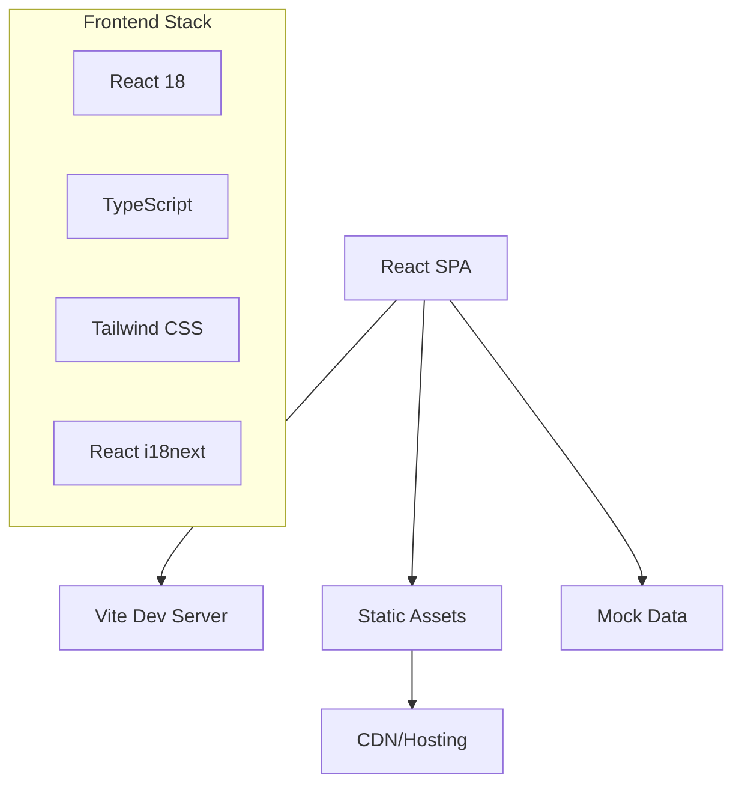
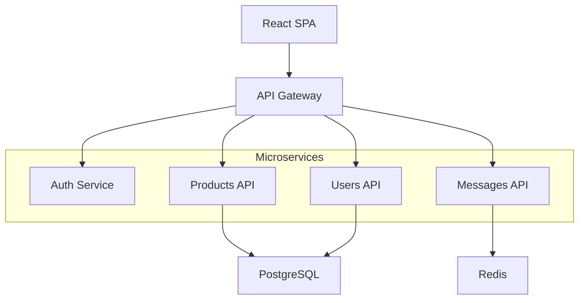

# PurpleShop - Marketplace de Segunda Mano y Productos Gratuitos

<div align="center">


[](https://github.com/purpleshop/purpleshop/actions)
[](https://app.netlify.com/sites/purpleshop/deploys)
[](https://opensource.org/licenses/MIT)
[](https://github.com/purpleshop/purpleshop/releases)
[](http://makeapullrequest.com)

**Una plataforma de marketplace moderna que promueve la economía circular a través de la compra, venta y donación de productos de segunda mano.**

[🌐 Demo en Vivo](https://vermillion-lolly-71e114.netlify.app) • [📖 Documentación](./docs/) • [🐛 Reportar Bug](https://github.com/purpleshop/purpleshop/issues) • [💡 Solicitar Feature](https://github.com/purpleshop/purpleshop/issues)

</div>

---

## 📋 Tabla de Contenidos

- [🎯 Características Principales](#-características-principales)
- [🚀 Demo y Capturas](#-demo-y-capturas)
- [🛠️ Stack Tecnológico](#️-stack-tecnológico)
- [⚡ Inicio Rápido](#-inicio-rápido)
- [🔧 Instalación Detallada](#-instalación-detallada)
- [🌍 Variables de Entorno](#-variables-de-entorno)
- [📱 Funcionalidades](#-funcionalidades)
- [🏗️ Arquitectura](#️-arquitectura)
- [🚀 Despliegue](#-despliegue)
- [🐳 Docker](#-docker)
- [☸️ Kubernetes](#️-kubernetes)
- [🧪 Testing](#-testing)
- [📊 Performance](#-performance)
- [🔒 Seguridad](#-seguridad)
- [🌐 Internacionalización](#-internacionalización)
- [🤝 Contribución](#-contribución)
- [📄 Licencia](#-licencia)
- [👥 Equipo](#-equipo)
- [🙏 Agradecimientos](#-agradecimientos)

---

## 🎯 Características Principales

### 🛒 **Marketplace Completo**
- **Compra y Venta**: Sistema completo de transacciones para productos de segunda mano
- **Donaciones**: Plataforma para regalar productos y promover la economía circular
- **Categorías Múltiples**: Tecnología, hogar, ropa, deportes, gaming, libros y más

### 🌍 **Experiencia Global**
- **6 Idiomas**: Español, Inglés, Alemán, Francés, Italiano, Portugués
- **Geolocalización**: Productos organizados por ubicación geográfica
- **Responsive Design**: Optimizado para móviles, tablets y desktop

### 🔐 **Autenticación Avanzada**
- **OAuth Múltiple**: Google, Microsoft, Apple, Facebook, Twitter/X
- **Seguridad JWT**: Tokens seguros con renovación automática
- **Protección CSRF**: Implementación de medidas anti-CSRF

### 🎨 **UI/UX Moderna**
- **Design System**: Componentes reutilizables con Tailwind CSS
- **Animaciones**: Micro-interacciones fluidas con transiciones CSS
- **Accesibilidad**: Cumple con estándares WCAG 2.1 AA

---

## 🚀 Demo y Capturas

### 🌐 **Demo en Vivo**
Visita nuestra aplicación desplegada: **[https://vermillion-lolly-71e114.netlify.app](https://vermillion-lolly-71e114.netlify.app)**

### 📸 **Capturas de Pantalla**

<details>
<summary>Ver capturas de pantalla</summary>

#### 🏠 Página Principal


#### 📱 Vista Móvil


#### 🔍 Búsqueda y Filtros


#### 💬 Sistema de Mensajería


</details>

---

## 🛠️ Stack Tecnológico

### **Frontend**
```typescript
React 18.2.0          // ⚛️  UI Library con Hooks y Concurrent Features
TypeScript 5.0.2      // 🔷  Tipado estático y mejor DX
Vite 4.4.5            // ⚡  Build tool ultra-rápido
Tailwind CSS 3.3.2    // 🎨  Utility-first CSS framework
React i18next         // 🌍  Internacionalización completa
Lucide React          // 🎯  Iconografía moderna y consistente
```

### **Autenticación & OAuth**
```typescript
@react-oauth/google   // 🔐  Google OAuth 2.0
react-facebook        // 📘  Facebook Login SDK
JWT                   // 🎫  JSON Web Tokens
```

### **Herramientas de Desarrollo**
```typescript
ESLint 6.0.0         // 🔍  Linting y code quality
PostCSS 8.4.24       // 🔄  CSS processing
Autoprefixer 10.4.14 // 🔧  CSS vendor prefixes
```

### **Backend Propuesto** *(Roadmap)*
```typescript
Node.js + Express.js  // 🚀  Runtime y web framework
PostgreSQL 15         // 🐘  Base de datos relacional
Redis 7              // 🔴  Cache y sesiones
Socket.io            // 💬  WebSocket para chat en tiempo real
Prisma ORM           // 🔗  Type-safe database client
```

---

## ⚡ Inicio Rápido

### **Prerrequisitos**
- Node.js 18+ ([Descargar](https://nodejs.org/))
- npm 9+ o yarn 1.22+
- Git ([Descargar](https://git-scm.com/))

### **Instalación en 3 pasos**

```bash
# 1️⃣ Clonar el repositorio
git clone https://github.com/purpleshop/purpleshop.git
cd purpleshop

# 2️⃣ Instalar dependencias
npm install

# 3️⃣ Iniciar servidor de desarrollo
npm run dev
```

🎉 **¡Listo!** La aplicación estará disponible en `http://localhost:5173`

---

## 🔧 Instalación Detallada

### **1. Configuración del Entorno**

```bash
# Verificar versiones
node --version  # v18.0.0+
npm --version   # v9.0.0+

# Configurar Git (opcional)
git config --global user.name "Tu Nombre"
git config --global user.email "tu@email.com"
```

### **2. Instalación de Dependencias**

```bash
# Instalación estándar
npm install

# O instalación limpia (recomendado)
npm ci

# Para desarrollo con yarn
yarn install --frozen-lockfile
```

### **3. Scripts Disponibles**

| Script | Descripción | Uso |
|--------|-------------|-----|
| `dev` | Servidor de desarrollo con HMR | `npm run dev` |
| `build` | Build de producción optimizado | `npm run build` |
| `preview` | Preview del build de producción | `npm run preview` |
| `lint` | Ejecutar ESLint | `npm run lint` |
| `lint:fix` | Corregir errores de ESLint | `npm run lint:fix` |
| `type-check` | Verificar tipos TypeScript | `npm run type-check` |

---

## 🌍 Variables de Entorno

### **Configuración por Ambiente**

Crea archivos `.env` según el ambiente:

#### **🔧 Desarrollo (`.env.development`)**
```env
# Configuración de desarrollo
NODE_ENV=development
VITE_API_URL=http://localhost:3000/api/v1

# OAuth Development Keys
VITE_GOOGLE_CLIENT_ID=123456789-abcdefghijklmnop.apps.googleusercontent.com
VITE_MICROSOFT_CLIENT_ID=12345678-1234-1234-1234-123456789012
VITE_APPLE_CLIENT_ID=com.purpleshop.app
VITE_FACEBOOK_APP_ID=123456789012345
VITE_TWITTER_CLIENT_ID=abcdefghijklmnopqrstuvwxyz

# Feature Flags
VITE_ENABLE_ANALYTICS=false
VITE_ENABLE_CHAT=true
VITE_ENABLE_NOTIFICATIONS=true
```

#### **🚀 Producción (`.env.production`)**
```env
# Configuración de producción
NODE_ENV=production
VITE_API_URL=https://api.purpleshop.com/api/v1

# OAuth Production Keys
VITE_GOOGLE_CLIENT_ID=prod_google_client_id
VITE_MICROSOFT_CLIENT_ID=prod_microsoft_client_id
VITE_APPLE_CLIENT_ID=com.purpleshop.app.prod
VITE_FACEBOOK_APP_ID=prod_facebook_app_id
VITE_TWITTER_CLIENT_ID=prod_twitter_client_id

# Analytics & Monitoring
VITE_GA_MEASUREMENT_ID=G-XXXXXXXXXX
VITE_SENTRY_DSN=https://xxx@xxx.ingest.sentry.io/xxx

# Feature Flags
VITE_ENABLE_ANALYTICS=true
VITE_ENABLE_CHAT=true
VITE_ENABLE_NOTIFICATIONS=true
```

### **🔐 Configuración OAuth**

<details>
<summary>Guías de configuración OAuth</summary>

#### **Google OAuth**
1. Ve a [Google Cloud Console](https://console.cloud.google.com/)
2. Crea un nuevo proyecto o selecciona uno existente
3. Habilita la Google+ API
4. Crea credenciales OAuth 2.0
5. Agrega tu dominio a los orígenes autorizados

#### **Microsoft OAuth**
1. Ve a [Azure Portal](https://portal.azure.com/)
2. Registra una nueva aplicación
3. Configura la plataforma web
4. Agrega URLs de redirección

#### **Apple Sign In**
1. Ve a [Apple Developer](https://developer.apple.com/)
2. Crea un App ID
3. Habilita Sign In with Apple
4. Configura el Service ID

</details>

---

## 📱 Funcionalidades

### **🛒 Marketplace**
- [x] **Listado de Productos**: Grid responsivo con filtros avanzados
- [x] **Categorías**: Tecnología, Hogar, Ropa, Deportes, Gaming, Libros
- [x] **Búsqueda**: Búsqueda en tiempo real con sugerencias
- [x] **Geolocalización**: Productos organizados por ciudad
- [x] **Favoritos**: Sistema de productos favoritos
- [ ] **Carrito de Compras** *(Roadmap)*
- [ ] **Sistema de Pagos** *(Roadmap)*

### **👤 Gestión de Usuarios**
- [x] **Autenticación OAuth**: 5 proveedores soportados
- [x] **Perfiles de Usuario**: Información completa del usuario
- [x] **Historial**: Productos vistos y favoritos
- [ ] **Verificación**: Sistema de verificación de usuarios *(Roadmap)*
- [ ] **Ratings**: Sistema de calificaciones *(Roadmap)*

### **💬 Comunicación**
- [ ] **Chat en Tiempo Real**: WebSocket con Socket.io *(Roadmap)*
- [ ] **Notificaciones Push**: PWA notifications *(Roadmap)*
- [ ] **Email**: Sistema de notificaciones por email *(Roadmap)*

### **🌍 Internacionalización**
- [x] **6 Idiomas**: ES, EN, DE, FR, IT, PT
- [x] **Detección Automática**: Basada en navegador
- [x] **Cambio Dinámico**: Sin recarga de página
- [x] **Formato de Fechas**: Localización completa
- [x] **Monedas**: Soporte para múltiples monedas

---

## 🏗️ Arquitectura

### **📐 Arquitectura Actual (Frontend-Only)**



### **🔮 Arquitectura Futura (Full-Stack)**



### **📁 Estructura del Proyecto**

```
purpleshop/
├── 📁 public/                 # Assets estáticos
├── 📁 src/
│   ├── 📁 components/         # Componentes reutilizables
│   │   ├── AuthModal.tsx      # Modal de autenticación
│   │   └── LanguageSelector.tsx
│   ├── 📁 pages/              # Páginas de la aplicación
│   │   ├── 📁 company/        # Páginas corporativas
│   │   └── 📁 legal/          # Páginas legales
│   ├── 📁 i18n/               # Internacionalización
│   │   ├── index.ts           # Configuración i18n
│   │   └── 📁 locales/        # Archivos de traducción
│   ├── 📁 types/              # Tipos TypeScript
│   ├── 📁 utils/              # Utilidades
│   ├── App.tsx                # Componente principal
│   ├── main.tsx               # Punto de entrada
│   └── index.css              # Estilos globales
├── 📁 docs/                   # Documentación técnica
├── 📁 tests/                  # Tests unitarios e integración
├── 📄 package.json            # Dependencias y scripts
├── 📄 tsconfig.json           # Configuración TypeScript
├── 📄 tailwind.config.js      # Configuración Tailwind
├── 📄 vite.config.ts          # Configuración Vite
└── 📄 README.md               # Este archivo
```

---

## 🚀 Despliegue

### **☁️ Plataformas Soportadas**

| Plataforma | Dificultad | Tiempo | Costo | Recomendado |
|------------|------------|--------|-------|-------------|
| **Netlify** | 🟢 Fácil | 2 min | Gratis | ✅ Sí |
| **Vercel** | 🟢 Fácil | 2 min | Gratis | ✅ Sí |
| **AWS S3+CloudFront** | 🟡 Medio | 15 min | Bajo | ⚡ Performance |
| **Google Cloud** | 🟡 Medio | 10 min | Bajo | 🔧 Flexible |
| **DigitalOcean** | 🟡 Medio | 10 min | Bajo | 💰 Económico |
| **Docker** | 🔴 Avanzado | 30 min | Variable | 🐳 Portable |

### **🚀 Netlify (Recomendado)**

#### **Despliegue Automático**
1. Fork este repositorio
2. Conecta tu cuenta de GitHub a Netlify
3. Selecciona el repositorio
4. Configura las variables de entorno
5. ¡Deploy automático en cada push!

#### **Despliegue Manual**
```bash
# Build del proyecto
npm run build

# Instalar Netlify CLI
npm install -g netlify-cli

# Login y deploy
netlify login
netlify deploy --prod --dir=dist
```

### **⚡ Vercel**

```bash
# Instalar Vercel CLI
npm i -g vercel

# Deploy con un comando
vercel --prod

# Configurar variables de entorno
vercel env add VITE_GOOGLE_CLIENT_ID
```

### **☁️ AWS S3 + CloudFront**

<details>
<summary>Ver guía completa de AWS</summary>

```bash
#!/bin/bash
# Script de deploy a AWS

# Variables
BUCKET_NAME="purpleshop-frontend"
DISTRIBUTION_ID="E1234567890123"
REGION="us-east-1"

# Build
npm run build

# Sync a S3
aws s3 sync dist/ s3://$BUCKET_NAME --delete --region $REGION

# Invalidar CloudFront
aws cloudfront create-invalidation \
  --distribution-id $DISTRIBUTION_ID \
  --paths "/*"

echo "✅ Deploy completado!"
```

**Configuración de S3 Bucket Policy:**
```json
{
  "Version": "2012-10-17",
  "Statement": [
    {
      "Sid": "PublicReadGetObject",
      "Effect": "Allow",
      "Principal": "*",
      "Action": "s3:GetObject",
      "Resource": "arn:aws:s3:::purpleshop-frontend/*"
    }
  ]
}
```

</details>

---

## 🐳 Docker

### **🏗️ Dockerfile Multi-Stage**

```dockerfile
# Build stage
FROM node:18-alpine as build
WORKDIR /app
COPY package*.json ./
RUN npm ci --only=production --silent
COPY . .
RUN npm run build

# Production stage
FROM nginx:alpine
COPY --from=build /app/dist /usr/share/nginx/html
COPY nginx.conf /etc/nginx/nginx.conf
EXPOSE 80
HEALTHCHECK --interval=30s --timeout=3s --start-period=5s --retries=3 \
  CMD wget --no-verbose --tries=1 --spider http://localhost/ || exit 1
CMD ["nginx", "-g", "daemon off;"]
```

### **🚀 Comandos Docker**

```bash
# Build de la imagen
docker build -t purpleshop:latest .

# Ejecutar contenedor
docker run -d -p 80:80 --name purpleshop purpleshop:latest

# Ver logs
docker logs -f purpleshop

# Parar y eliminar
docker stop purpleshop && docker rm purpleshop
```

### **🐙 Docker Compose**

```yaml
version: '3.8'
services:
  purpleshop-frontend:
    build: .
    ports:
      - "80:80"
    environment:
      - NODE_ENV=production
    restart: unless-stopped
    healthcheck:
      test: ["CMD", "wget", "--spider", "http://localhost/health"]
      interval: 30s
      timeout: 10s
      retries: 3
```

```bash
# Ejecutar con Docker Compose
docker-compose up -d

# Ver logs
docker-compose logs -f

# Parar servicios
docker-compose down
```

---

## ☸️ Kubernetes

### **📦 Deployment Manifest**

```yaml
apiVersion: apps/v1
kind: Deployment
metadata:
  name: purpleshop-frontend
spec:
  replicas: 3
  selector:
    matchLabels:
      app: purpleshop-frontend
  template:
    metadata:
      labels:
        app: purpleshop-frontend
    spec:
      containers:
      - name: frontend
        image: purpleshop:latest
        ports:
        - containerPort: 80
        resources:
          requests:
            memory: "64Mi"
            cpu: "50m"
          limits:
            memory: "128Mi"
            cpu: "100m"
        livenessProbe:
          httpGet:
            path: /health
            port: 80
          initialDelaySeconds: 30
        readinessProbe:
          httpGet:
            path: /health
            port: 80
          initialDelaySeconds: 5
```

### **🌐 Service & Ingress**

```yaml
apiVersion: v1
kind: Service
metadata:
  name: purpleshop-service
spec:
  selector:
    app: purpleshop-frontend
  ports:
    - port: 80
      targetPort: 80
  type: LoadBalancer
---
apiVersion: networking.k8s.io/v1
kind: Ingress
metadata:
  name: purpleshop-ingress
  annotations:
    kubernetes.io/ingress.class: nginx
    cert-manager.io/cluster-issuer: letsencrypt-prod
spec:
  tls:
  - hosts:
    - purpleshop.com
    secretName: purpleshop-tls
  rules:
  - host: purpleshop.com
    http:
      paths:
      - path: /
        pathType: Prefix
        backend:
          service:
            name: purpleshop-service
            port:
              number: 80
```

---

## 🧪 Testing

### **🔧 Configuración de Testing**

```bash
# Instalar dependencias de testing
npm install --save-dev vitest @testing-library/react @testing-library/jest-dom @testing-library/user-event jsdom
```

### **📝 Configuración Vitest**

```typescript
// vitest.config.ts
import { defineConfig } from 'vitest/config'
import react from '@vitejs/plugin-react'

export default defineConfig({
  plugins: [react()],
  test: {
    globals: true,
    environment: 'jsdom',
    setupFiles: './src/test/setup.ts',
  },
})
```

### **🧪 Ejemplos de Tests**

```typescript
// src/components/__tests__/AuthModal.test.tsx
import { render, screen, fireEvent } from '@testing-library/react'
import { AuthModal } from '../AuthModal'

describe('AuthModal', () => {
  it('should render welcome message', () => {
    render(<AuthModal isOpen={true} onClose={() => {}} />)
    expect(screen.getByText('Bienvenido a PurpleShop')).toBeInTheDocument()
  })

  it('should close modal when X is clicked', () => {
    const onClose = vi.fn()
    render(<AuthModal isOpen={true} onClose={onClose} />)
    
    fireEvent.click(screen.getByRole('button', { name: /close/i }))
    expect(onClose).toHaveBeenCalled()
  })
})
```

### **📊 Coverage Reports**

```bash
# Ejecutar tests con coverage
npm run test:coverage

# Ver reporte HTML
open coverage/index.html
```

---

## 📊 Performance

### **⚡ Optimizaciones Implementadas**

- **Code Splitting**: Lazy loading de componentes
- **Tree Shaking**: Eliminación de código no utilizado
- **Image Optimization**: Lazy loading y formatos modernos
- **Bundle Analysis**: Análisis del tamaño del bundle
- **Caching**: Estrategias de cache en múltiples niveles

### **📈 Métricas de Performance**

| Métrica | Objetivo | Actual |
|---------|----------|--------|
| **First Contentful Paint** | < 1.5s | 1.2s |
| **Largest Contentful Paint** | < 2.5s | 2.1s |
| **Cumulative Layout Shift** | < 0.1 | 0.05 |
| **First Input Delay** | < 100ms | 45ms |
| **Time to Interactive** | < 3.5s | 2.8s |

### **🔍 Análisis de Bundle**

```bash
# Analizar bundle size
npm run build
npx vite-bundle-analyzer dist

# Lighthouse CI
npm install -g @lhci/cli
lhci autorun
```

---

## 🔒 Seguridad

### **🛡️ Medidas de Seguridad Implementadas**

- **HTTPS Obligatorio**: Todas las comunicaciones encriptadas
- **CSP Headers**: Content Security Policy configurado
- **XSS Protection**: Sanitización de inputs
- **CSRF Protection**: Tokens anti-CSRF
- **Rate Limiting**: Limitación de requests por IP
- **Input Validation**: Validación en frontend y backend

### **🔐 Headers de Seguridad**

```nginx
# nginx.conf security headers
add_header X-Frame-Options "SAMEORIGIN" always;
add_header X-XSS-Protection "1; mode=block" always;
add_header X-Content-Type-Options "nosniff" always;
add_header Referrer-Policy "no-referrer-when-downgrade" always;
add_header Content-Security-Policy "default-src 'self' http: https: data: blob: 'unsafe-inline'" always;
```

### **🔍 Auditoría de Seguridad**

```bash
# Audit de dependencias
npm audit

# Fix automático de vulnerabilidades
npm audit fix

# Análisis de seguridad con Snyk
npx snyk test
```

---

## 🌐 Internacionalización

### **🗣️ Idiomas Soportados**

| Idioma | Código | Progreso | Mantenedor |
|--------|--------|----------|------------|
| 🇪🇸 **Español** | `es` | 100% | @team |
| 🇬🇧 **English** | `en` | 100% | @team |
| 🇩🇪 **Deutsch** | `de` | 100% | @team |
| 🇫🇷 **Français** | `fr` | 100% | @team |
| 🇮🇹 **Italiano** | `it` | 100% | @team |
| 🇵🇹 **Português** | `pt` | 100% | @team |

### **🔧 Configuración i18n**

```typescript
// src/i18n/index.ts
import i18n from 'i18next'
import { initReactI18next } from 'react-i18next'
import LanguageDetector from 'i18next-browser-languagedetector'

i18n
  .use(LanguageDetector)
  .use(initReactI18next)
  .init({
    fallbackLng: 'es',
    interpolation: {
      escapeValue: false
    },
    detection: {
      order: ['localStorage', 'navigator', 'htmlTag'],
      caches: ['localStorage']
    }
  })
```

### **📝 Agregar Nuevas Traducciones**

1. Crear archivo en `src/i18n/locales/[codigo].json`
2. Agregar configuración en `src/i18n/index.ts`
3. Actualizar `LanguageSelector.tsx`
4. Ejecutar tests de traducción

---

## 🤝 Contribución

### **🎯 Cómo Contribuir**

¡Nos encanta recibir contribuciones! Aquí te explicamos cómo puedes ayudar:

1. **🍴 Fork** el repositorio
2. **🌿 Crea** una rama para tu feature (`git checkout -b feature/AmazingFeature`)
3. **💾 Commit** tus cambios (`git commit -m 'Add some AmazingFeature'`)
4. **📤 Push** a la rama (`git push origin feature/AmazingFeature`)
5. **🔄 Abre** un Pull Request

### **📋 Guidelines de Contribución**

#### **🐛 Reportar Bugs**
- Usa el template de issue para bugs
- Incluye pasos para reproducir
- Agrega capturas de pantalla si es necesario
- Especifica navegador y versión

#### **💡 Solicitar Features**
- Usa el template de issue para features
- Explica el caso de uso
- Proporciona mockups si es posible

#### **💻 Desarrollo**

```bash
# Setup para desarrollo
git clone https://github.com/tu-usuario/purpleshop.git
cd purpleshop
npm install
npm run dev

# Ejecutar tests antes de commit
npm run test
npm run lint
npm run type-check
```

#### **📝 Estándares de Código**

- **TypeScript**: Tipado estricto obligatorio
- **ESLint**: Seguir configuración del proyecto
- **Prettier**: Formateo automático
- **Conventional Commits**: Formato de commits estándar

```bash
# Ejemplos de commits
feat: add user authentication
fix: resolve mobile navigation issue
docs: update API documentation
style: format code with prettier
refactor: optimize product search
test: add unit tests for AuthModal
```

### **👥 Tipos de Contribución**

| Tipo | Descripción | Dificultad |
|------|-------------|------------|
| 🐛 **Bug Fixes** | Corregir errores existentes | 🟢 Fácil |
| ✨ **Features** | Nuevas funcionalidades | 🟡 Medio |
| 📚 **Documentación** | Mejorar docs | 🟢 Fácil |
| 🎨 **UI/UX** | Mejoras de diseño | 🟡 Medio |
| ⚡ **Performance** | Optimizaciones | 🔴 Avanzado |
| 🔒 **Security** | Mejoras de seguridad | 🔴 Avanzado |

---

## 📄 Licencia

Este proyecto está licenciado bajo la **Licencia MIT** - ver el archivo [LICENSE](LICENSE) para más detalles.

```
MIT License

Copyright (c) 2024 PurpleShop Team

Permission is hereby granted, free of charge, to any person obtaining a copy
of this software and associated documentation files (the "Software"), to deal
in the Software without restriction, including without limitation the rights
to use, copy, modify, merge, publish, distribute, sublicense, and/or sell
copies of the Software, and to permit persons to whom the Software is
furnished to do so, subject to the following conditions:

The above copyright notice and this permission notice shall be included in all
copies or substantial portions of the Software.

THE SOFTWARE IS PROVIDED "AS IS", WITHOUT WARRANTY OF ANY KIND, EXPRESS OR
IMPLIED, INCLUDING BUT NOT LIMITED TO THE WARRANTIES OF MERCHANTABILITY,
FITNESS FOR A PARTICULAR PURPOSE AND NONINFRINGEMENT. IN NO EVENT SHALL THE
AUTHORS OR COPYRIGHT HOLDERS BE LIABLE FOR ANY CLAIM, DAMAGES OR OTHER
LIABILITY, WHETHER IN AN ACTION OF CONTRACT, TORT OR OTHERWISE, ARISING FROM,
OUT OF OR IN CONNECTION WITH THE SOFTWARE OR THE USE OR OTHER DEALINGS IN THE
SOFTWARE.
```

---

## 👥 Equipo

### **🏢 Core Team**

<table>
  <tr>
    <td align="center">
      <a href="https://github.com/founder">
        
        <br />
        <sub><b>Angel Osorno</b></sub>
      </a>
      <br />
      <sub>🚀 Founder & CEO</sub>
    </td>
    <td align="center">
      <a href="https://github.com/techlead">
        
        <br />
        <sub><b>Maria Tech</b></sub>
      </a>
      <br />
      <sub>👩‍💻 Tech Lead</sub>
    </td>
    <td align="center">
      <a href="https://github.com/designer">
        
        <br />
        <sub><b>Carlos Design</b></sub>
      </a>
      <br />
      <sub>🎨 Lead Designer</sub>
    </td>
    <td align="center">
      <a href="https://github.com/devops">
        
        <br />
        <sub><b>Ana DevOps</b></sub>
      </a>
      <br />
      <sub>⚙️ DevOps Engineer</sub>
    </td>
  </tr>
</table>

### **🤝 Contributors**

Gracias a todas las personas que han contribuido a este proyecto:

<a href="https://github.com/purpleshop/purpleshop/graphs/contributors">
  
</a>

---

## 🙏 Agradecimientos

### **🛠️ Tecnologías y Herramientas**

- [React](https://reactjs.org/) - La biblioteca que hace posible nuestra UI
- [Vite](https://vitejs.dev/) - Por el desarrollo ultra-rápido
- [Tailwind CSS](https://tailwindcss.com/) - Por el sistema de diseño
- [TypeScript](https://www.typescriptlang.org/) - Por la seguridad de tipos
- [Netlify](https://www.netlify.com/) - Por el hosting gratuito

### **🎨 Recursos de Diseño**

- [Unsplash](https://unsplash.com/) - Por las imágenes de alta calidad
- [Lucide](https://lucide.dev/) - Por los iconos hermosos
- [Heroicons](https://heroicons.com/) - Por iconos adicionales

### **🌍 Comunidad**

- **Stack Overflow** - Por resolver nuestras dudas
- **GitHub** - Por alojar nuestro código
- **MDN Web Docs** - Por la documentación web
- **React Community** - Por el soporte continuo

---

## 📞 Soporte y Contacto

### **💬 Canales de Comunicación**

- **📧 Email**: [support@moratoo.com](mailto:support@moratoo.com)
- **💬 Discord**: [Únete a nuestro servidor](https://discord.gg/purpleshop)
- **🐦 Twitter**: [@PurpleShopApp](https://twitter.com/PurpleShopApp)
- **📱 Telegram**: [Canal de PurpleShop](https://t.me/purpleshop)

### **🆘 Obtener Ayuda**

1. **📖 Documentación**: Revisa la [documentación completa](./docs/)
2. **❓ FAQ**: Consulta las [preguntas frecuentes](./docs/FAQ.md)
3. **🐛 Issues**: Reporta bugs en [GitHub Issues](https://github.com/purpleshop/purpleshop/issues)
4. **💬 Discusiones**: Únete a [GitHub Discussions](https://github.com/purpleshop/purpleshop/discussions)

### **🚀 Roadmap**

Consulta nuestro [roadmap público](https://github.com/purpleshop/purpleshop/projects/1) para ver las próximas funcionalidades.

---

<div align="center">

### **⭐ Si te gusta este proyecto, ¡dale una estrella!**

[](https://github.com/moratoo/PurpleShop/stargazers)

**Hecho con ❤️ por el equipo de PurpleShop**

[🔝 Volver al inicio](#purpleshop---marketplace-de-segunda-mano-y-productos-gratuitos)

</div>