# Arquitectura del Sistema - PurpleShop

## 🏗️ Visión General de la Arquitectura

PurpleShop está diseñado como una aplicación web moderna con arquitectura de microservicios, siguiendo principios de escalabilidad, mantenibilidad y alta disponibilidad.

### Arquitectura Actual (Frontend-Only)
```
┌─────────────────┐    ┌──────────────────┐    ┌─────────────────┐
│   React SPA     │────│   Static Assets  │────│   CDN/Hosting   │
│   (TypeScript)  │    │   (Images, CSS)  │    │   (Netlify)     │
└─────────────────┘    └──────────────────┘    └─────────────────┘
         │
         ▼
┌─────────────────┐
│   Mock Data     │
│   (Local State) │
└─────────────────┘
```

### Arquitectura Propuesta (Full-Stack)
```
┌─────────────────┐    ┌──────────────────┐    ┌─────────────────┐
│   React SPA     │────│   Load Balancer  │────│   CDN/Hosting   │
│   (TypeScript)  │    │   (Nginx/AWS)    │    │   (CloudFront)  │
└─────────────────┘    └──────────────────┘    └─────────────────┘
         │                        │
         ▼                        ▼
┌─────────────────┐    ┌──────────────────┐
│   API Gateway   │────│   Auth Service   │
│   (Express.js)  │    │   (JWT/OAuth)    │
└─────────────────┘    └──────────────────┘
         │
         ▼
┌─────────────────┐    ┌──────────────────┐    ┌─────────────────┐
│   Products API  │────│   Users API      │────│   Messages API  │
│   (Node.js)     │    │   (Node.js)      │    │   (Socket.io)   │
└─────────────────┘    └──────────────────┘    └─────────────────┘
         │                        │                        │
         ▼                        ▼                        ▼
┌─────────────────┐    ┌──────────────────┐    ┌─────────────────┐
│   PostgreSQL    │────│   Redis Cache    │────│   File Storage  │
│   (Primary DB)  │    │   (Sessions)     │    │   (AWS S3)      │
└─────────────────┘    └──────────────────┘    └─────────────────┘
```

## 🎯 Principios de Diseño

### 1. Separación de Responsabilidades
- **Frontend**: Interfaz de usuario y experiencia
- **Backend**: Lógica de negocio y datos
- **Base de Datos**: Persistencia y consultas
- **Cache**: Rendimiento y escalabilidad

### 2. Escalabilidad Horizontal
- Microservicios independientes
- Load balancing
- Cache distribuido
- CDN para assets estáticos

### 3. Seguridad por Capas
- HTTPS en todas las comunicaciones
- Autenticación JWT
- Validación en frontend y backend
- Rate limiting
- Sanitización de datos

### 4. Experiencia de Usuario
- Progressive Web App (PWA)
- Responsive design
- Offline capabilities
- Real-time updates

## 🔧 Stack Tecnológico Detallado

### Frontend
```typescript
// Tecnologías principales
React 18          // UI Library
TypeScript        // Type Safety
Vite             // Build Tool
Tailwind CSS     // Styling
React i18next    // Internationalization

// Librerías adicionales
React Query      // Data Fetching
React Router     // Client-side Routing
React Hook Form  // Form Management
Framer Motion    // Animations
Socket.io Client // Real-time Communication
```

### Backend
```typescript
// Core
Node.js          // Runtime
Express.js       // Web Framework
TypeScript       // Type Safety

// Base de Datos
PostgreSQL       // Primary Database
Redis            // Cache & Sessions
Prisma/TypeORM   // ORM

// Autenticación
Passport.js      // OAuth Strategies
JWT              // Token Management
bcrypt           // Password Hashing

// Comunicación
Socket.io        // WebSocket
Nodemailer       // Email Service
Bull Queue       // Job Processing
```

### DevOps & Infraestructura
```yaml
# Containerización
Docker           # Containerization
Docker Compose   # Local Development
Kubernetes       # Orchestration (Production)

# CI/CD
GitHub Actions   # Continuous Integration
Docker Registry  # Image Storage
AWS/GCP/Azure    # Cloud Provider

# Monitoreo
Prometheus       # Metrics
Grafana         # Dashboards
Sentry          # Error Tracking
Winston         # Logging
```

## 📊 Flujo de Datos

### Autenticación


### Creación de Producto

```mermaid
sequenceDiagram
    participant U as Usuario
    participant F as Frontend
    participant P as Products API
    participant S as Storage Service
    participant D as Database
    participant N as Notification Service

    U->>F: Crear producto + imágenes
    F->>P: POST /products (multipart)
    P->>S: Subir imágenes
    S->>P: URLs de imágenes
    P->>D: Guardar producto
    D->>P: Producto creado
    P->>N: Notificar nuevo producto
    P->>F: Respuesta exitosa
    F->>U: Producto publicado
```


### Búsqueda de Productos

```mermaid
sequenceDiagram
    participant U as Usuario
    participant F as Frontend
    participant A as API Gateway
    participant C as Cache (Redis)
    participant S as Search Service
    participant D as Database

    U->>F: Buscar "iPhone"
    F->>A: GET /search?q=iPhone
    A->>C: Verificar cache
    alt Cache Hit
        C->>A: Resultados cacheados
    else Cache Miss
        A->>S: Buscar en índice
        S->>D: Query compleja
        D->>S: Resultados
        S->>A: Resultados procesados
        A->>C: Guardar en cache
    end
    A->>F: Resultados de búsqueda
    F->>U: Mostrar productos
```


## 🔐 Seguridad

### Autenticación y Autorización
```typescript
// JWT Token Structure
interface JWTPayload {
  userId: string;
  email: string;
  role: 'user' | 'admin';
  iat: number;
  exp: number;
}

// Middleware de autorización
const authorize = (roles: string[]) => {
  return (req: Request, res: Response, next: NextFunction) => {
    const user = req.user;
    if (!user || !roles.includes(user.role)) {
      return res.status(403).json({ error: 'Forbidden' });
    }
    next();
  };
};
```

### Validación de Datos
```typescript
// Schema de validación con Joi
const productSchema = Joi.object({
  title: Joi.string().min(3).max(100).required(),
  description: Joi.string().min(10).max(1000).required(),
  price: Joi.number().min(0).optional(),
  category_id: Joi.string().uuid().required(),
  images: Joi.array().items(Joi.string().uri()).max(10)
});
```

### Rate Limiting
```typescript
// Configuración de rate limiting
const rateLimitConfig = {
  windowMs: 15 * 60 * 1000, // 15 minutos
  max: 100, // máximo 100 requests
  message: 'Too many requests',
  standardHeaders: true,
  legacyHeaders: false
};
```

## 📈 Escalabilidad

### Horizontal Scaling
```yaml
# Kubernetes Deployment
apiVersion: apps/v1
kind: Deployment
metadata:
  name: purpleshop-api
spec:
  replicas: 3
  selector:
    matchLabels:
      app: purpleshop-api
  template:
    spec:
      containers:
      - name: api
        image: purpleshop/api:latest
        ports:
        - containerPort: 3000
        env:
        - name: DATABASE_URL
          valueFrom:
            secretKeyRef:
              name: db-secret
              key: url
```

### Database Scaling
```sql
-- Read Replicas
-- Master: Escrituras
-- Slaves: Lecturas

-- Particionado por fecha
CREATE TABLE products_2024 PARTITION OF products
FOR VALUES FROM ('2024-01-01') TO ('2025-01-01');

-- Índices optimizados
CREATE INDEX CONCURRENTLY idx_products_search 
ON products USING GIN(to_tsvector('spanish', title || ' ' || description));
```

### Caching Strategy
```typescript
// Cache en múltiples niveles
interface CacheStrategy {
  // L1: Browser Cache
  browserCache: {
    staticAssets: '1 year',
    apiResponses: '5 minutes'
  };
  
  // L2: CDN Cache
  cdnCache: {
    images: '1 month',
    api: '1 minute'
  };
  
  // L3: Application Cache (Redis)
  appCache: {
    userSessions: '7 days',
    productLists: '10 minutes',
    searchResults: '5 minutes'
  };
}
```

## 🔄 Comunicación en Tiempo Real

### WebSocket Architecture
```typescript
// Socket.io Namespaces
const io = new Server(server);

// Namespace para chat
const chatNamespace = io.of('/chat');
chatNamespace.on('connection', (socket) => {
  socket.on('join-room', (roomId) => {
    socket.join(roomId);
  });
  
  socket.on('message', (data) => {
    chatNamespace.to(data.roomId).emit('new-message', data);
  });
});

// Namespace para notificaciones
const notificationNamespace = io.of('/notifications');
```

## 📱 Progressive Web App (PWA)

### Service Worker
```typescript
// sw.js - Service Worker
const CACHE_NAME = 'purpleshop-v1';
const urlsToCache = [
  '/',
  '/static/css/main.css',
  '/static/js/main.js',
  '/manifest.json'
];

self.addEventListener('install', (event) => {
  event.waitUntil(
    caches.open(CACHE_NAME)
      .then((cache) => cache.addAll(urlsToCache))
  );
});

self.addEventListener('fetch', (event) => {
  event.respondWith(
    caches.match(event.request)
      .then((response) => response || fetch(event.request))
  );
});
```

### Manifest.json
```json
{
  "name": "PurpleShop",
  "short_name": "PurpleShop",
  "description": "Marketplace de segunda mano",
  "start_url": "/",
  "display": "standalone",
  "background_color": "#9333ea",
  "theme_color": "#9333ea",
  "icons": [
    {
      "src": "/icons/icon-192x192.png",
      "sizes": "192x192",
      "type": "image/png"
    }
  ]
}
```

## 🔍 Monitoreo y Observabilidad

### Métricas de Aplicación
```typescript
// Prometheus metrics
import prometheus from 'prom-client';

const httpRequestDuration = new prometheus.Histogram({
  name: 'http_request_duration_seconds',
  help: 'Duration of HTTP requests in seconds',
  labelNames: ['method', 'route', 'status']
});

const activeUsers = new prometheus.Gauge({
  name: 'active_users_total',
  help: 'Number of active users'
});
```

### Health Checks
```typescript
// Health check endpoint
app.get('/health', async (req, res) => {
  const health = {
    status: 'ok',
    timestamp: new Date().toISOString(),
    services: {
      database: await checkDatabase(),
      redis: await checkRedis(),
      storage: await checkStorage()
    }
  };
  
  const isHealthy = Object.values(health.services)
    .every(service => service.status === 'ok');
    
  res.status(isHealthy ? 200 : 503).json(health);
});
```

## 🚀 Deployment Pipeline

### CI/CD Pipeline
```yaml
# .github/workflows/deploy.yml
name: Deploy to Production

on:
  push:
    branches: [main]

jobs:
  test:
    runs-on: ubuntu-latest
    steps:
      - uses: actions/checkout@v3
      - name: Run tests
        run: |
          npm ci
          npm run test
          npm run lint

  build:
    needs: test
    runs-on: ubuntu-latest
    steps:
      - name: Build Docker image
        run: |
          docker build -t purpleshop:${{ github.sha }} .
          docker push registry/purpleshop:${{ github.sha }}

  deploy:
    needs: build
    runs-on: ubuntu-latest
    steps:
      - name: Deploy to Kubernetes
        run: |
          kubectl set image deployment/purpleshop-api \
            api=registry/purpleshop:${{ github.sha }}
```

## 📊 Performance Optimization

### Frontend Optimizations
```typescript
// Code splitting
const ProductDetail = lazy(() => import('./pages/ProductDetail'));
const UserProfile = lazy(() => import('./pages/UserProfile'));

// Image optimization
const OptimizedImage = ({ src, alt, ...props }) => (
  
);

// Virtual scrolling para listas largas
import { FixedSizeList as List } from 'react-window';
```

### Backend Optimizations
```typescript
// Database query optimization
const getProductsOptimized = async (filters) => {
  return await db.product.findMany({
    where: filters,
    select: {
      id: true,
      title: true,
      price: true,
      images: true,
      user: {
        select: { name: true, rating: true }
      }
    },
    orderBy: { createdAt: 'desc' },
    take: 20
  });
};

// Connection pooling
const pool = new Pool({
  connectionString: process.env.DATABASE_URL,
  max: 20,
  idleTimeoutMillis: 30000,
  connectionTimeoutMillis: 2000
});
```

Esta arquitectura proporciona una base sólida para el crecimiento de PurpleShop, permitiendo escalabilidad, mantenibilidad y una excelente experiencia de usuario.